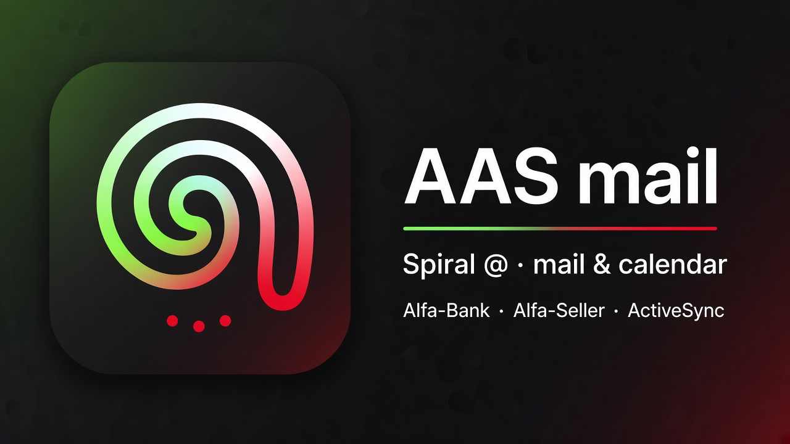

# AAS mail



Локальный клиент почты и календаря для **Alfa-Bank** и **Alfa-Seller** поверх Exchange ActiveSync.

- Нативное macOS-приложение (WKWebView + menu-bar tray)
- Веб-UI + локальный сервер `webapp.py` (127.0.0.1:8780)
- Пароли в Keychain; адреса серверов по умолчанию:
  - Bank: `https://owa.alfabank.ru/Microsoft-Server-ActiveSync`
  - Seller: `https://sync.alfaops.ru/Microsoft-Server-ActiveSync`

## Быстрый старт (разработка)

```bash
cd app
bash build_app.sh          # → ~/Applications/AAS mail.app (или Почта EAS.app)
open ~/Applications/AAS\ mail.app
```

## Пакет для коллег (без кредов)

```bash
cd app
bash build_dist.sh         # → ../dist/AAS-mail-*-mac.zip
```

Коллеги вводят свои логин/пароль в Настройках; серверы уже подставлены.

## Установка у коллег и автообновление

Нужен только доступ к github.com (репозиторий публичный, ни `gh`, ни входа не требуется). Один раз:

```bash
curl -fsSL https://raw.githubusercontent.com/olesyaba/aas-mail/main/install.sh | bash
```

Или вручную: скачать `AAS-mail-X.Y.Z-mac.zip` со страницы
[Releases](https://github.com/olesyaba/aas-mail/releases/latest), распаковать и перенести
`AAS mail.app` в «Программы» (см. `КАК_УСТАНОВИТЬ.txt` в архиве).

`install.sh` находит последний релиз, скачивает архив, сверяет его SHA-256 с опубликованным
на GitHub и кладёт `AAS mail.app` в `~/Applications`.

Дальше обновления — в Настройках, вкладка «Обновления»: «Автоматически» (проверка раз в 6 ч,
новая версия ставится сама, но не во время открытого окна, например письма) или «Только по запросу»
(кнопка «Проверить сейчас», затем «Обновить до X»). Приложение скачивает релиз по HTTPS
с github.com, сверяет контрольную сумму и версию внутри архива, закрывается, заменяет себя
и открывается снова (при сбое возвращает старую версию; журнал — `~/.config/eas-bridge/update.log`).
Версии до 1.2.17 обновлялись через `gh`: на них один раз поставьте 1.2.17 командой выше
или из архива — дальше обновления приходят сами.
Сборка из исходников (`build_app.sh`) не заменяет себя — только сообщает о версии.

Выпуск новой версии: поднять `version` в `webapp.py`, дописать `RELEASE_NOTES.txt`, закоммитить и

```bash
app/release.sh             # тесты → dist zip → privacy scan → gh release create vX.Y.Z
```

## Android (Galaxy Z Fold)

Тот же `webapp.py` и `web/` внутри Kotlin-оболочки (`android/`, Chaquopy). Внешний экран — одна
панель (список ↔ письмо), внутренний — список + письмо; уведомления о письмах раз в ~15 мин и
точные напоминания о встречах.

```bash
bash android/build_apk.sh debug    # dist/AAS-mail-<v>-android-debug.apk — для проверки
bash android/build_apk.sh          # release: ключ ~/.config/aas-mail/android-release.jks + AAS_KEYSTORE_PASS
(cd android && ./gradlew testDebugUnitTest)   # Kotlin-логика уведомлений
```

Установка: скопировать APK на телефон и открыть (разрешить установку из этого источника), либо
`adb install -r dist/AAS-mail-<v>-android.apk`. При первом запуске разрешить уведомления, точные
будильники и работу в фоне — без них уведомления опаздывают. Обновление — вручную, новым APK
со страницы релиза (`app/release.sh` прикладывает его, если он собран).

## Тесты

```bash
bash tests/run_tests.sh            # всё: py + js + swift
bash tests/run_tests.sh py js      # выборочно
```

- `tests/python` — логика бэкенда, HTTP-защита, контракт UI↔API, запуск `webapp.py` целиком
  (временный конфиг, реальный `~/.config/eas-bridge` не трогается)
- `tests/js` — функции `web/index.html` в песочнице Node (без браузера)
- `tests/swift` — логика трея (счётчик в меню, напоминания, ссылки «Подключиться»)

## Структура

```
aas-mail/
  webapp.py      # HTTP API + UI server
  bridge.py      # ActiveSync backend wrapper
  web/           # index.html UI
  app/           # Swift shell, tray, build_*.sh
  android/       # Kotlin shell for Android (Chaquopy + WebView), build_apk.sh
  docs/          # specs / plans
```

Контакт: Mattermost `@olesya_ba`
